# ✂️ Emoji Mosaic

This repository contains the source code for the website [https://emojimosaic.dev](https://emojimosaic.dev).

This website allows for taking a source image, slicing it into smaller images that can be uploaded as individual emoji to create mosaics in Slack, Discord, or other messaging platforms.

## Example Usage

### Upload Image

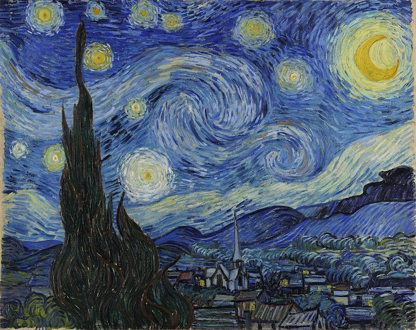

### Download Image Parts

#### Bulk Upload Emoji to Slack

Slack currently does not expose a way to bulk upload emoji through their web interface; however, this Google Chrome extension can be used to make this upload process quick and easy!

[Neutral Face Emoji Tools](https://chrome.google.com/webstore/detail/neutral-face-emoji-tools/anchoacphlfbdomdlomnbbfhcmcdmjej)

#### Image Parts

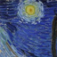 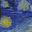 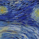 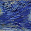 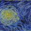

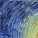 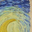  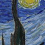 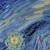

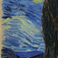 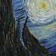 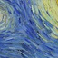  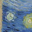

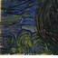 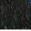  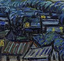 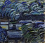

### Create Mosaic

This application gives users a quick-copy button to be able to copy the Slack-friendly formatted text after the emoji have been properly uploaded to the workspace. For example, the mosaic below is generated from the following text block

```
:starry-night-1::starry-night-2::starry-night-3::starry-night-4::starry-night-5:
:starry-night-6::starry-night-7::starry-night-8::starry-night-9::starry-night-10:
:starry-night-11::starry-night-12::starry-night-13::starry-night-14::starry-night-15:
:starry-night-16::starry-night-17::starry-night-18::starry-night-19::starry-night-20:
```

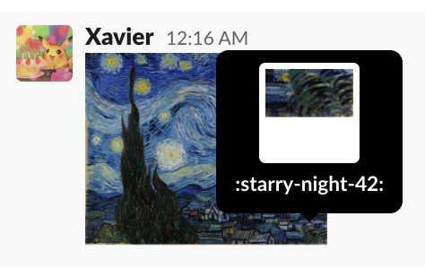

## Getting Started

This repository leverages [VSCode's devcontainer](https://code.visualstudio.com/docs/remote/containers) feature to ensure all necessary dependencies are available inside the container for development.

### Application

To get started:

```bash
npm init && npm start
```

This will start the application on your local machine, running on [http://localhost:3000/](http://localhost:3000).

### Deployments

All application deployments are managed via GitHub Actions and the [`./.github/workflows/deploy.yml`](./.github/workflows/deploy.yml) workflow.

Additionally, application dependencies are automatically managed and updated via Dependabot and the [`./.github/workflows/automerge-dependabot.yml`](./.github/workflows/automerge-dependabot.yml) workflow.
